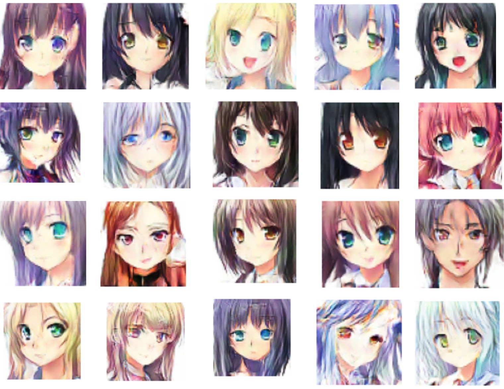
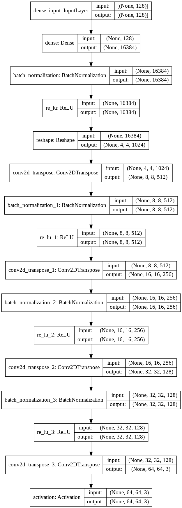
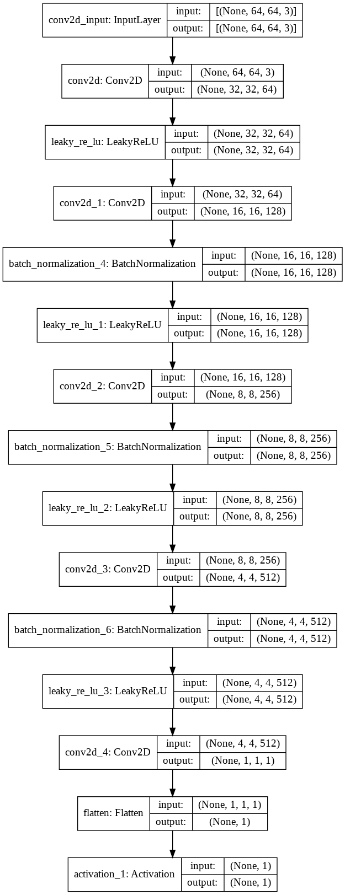

# Anime-Face-GAN
Generating anime faces using a Deep Convolutional Generative Adversarial Network (DCGAN).  
Here are a few images generated by the DCGAN ⬇️  
  

# Dataset used
The dataset is taken from Kaggle over [here](https://www.kaggle.com/soumikrakshit/anime-faces). The data was obtained from www.getchu.com and processed using a face
detector based on the repo https://github.com/nagadomi/lbpcascade_animeface.
The dataset contains images of size 64 by 64 pixels.

# Objective 🎯
- The objective of the project is to generate images of Anime faces using a Deep Convolutional GAN.
- The DCGAN has two networks, the 'generator' and the 'discriminator'.  
- The generator takes in a random vector which then uses transposed convolutions to generate an image out of it.  
- The discriminator is a Convolutional network which then classifies whether an image is real or fake. It takes in samples of images from the dataset
 and also images generated by the generator.  
- Both networks try to improve each other's performance through backpropagation.

# Architecture used

The architecture is inspired by the original DCGAN paper. However 'one-sided label smoothing' has been added to prevent the discriminator from overpowering the generator.
The weights for the generator and discriminator can be found [here](https://drive.google.com/drive/folders/1WesJlksOcDhGqwtNJhHKZhN1ehJtZZt4?usp=sharing)

### Generator
The generator takes in a 128 dimensional noise vector sampled from a normal distribution of zero mean and unit variance N(0,1).
It is then followed by a Dense layer of 4x4x1024 units and reshaped to (4,4,1024).  
Then a few transposed convolutional layers are followed which then results in an image of size (64,64,3) with pixel values of the range [-1,1]
due to a tanh activation.  

### Discriminator
The discriminator is similar to a image classification CNN which takes in an image and outputs the probability of it being real.  

# Progress

# Requirements ✅
- ###### python 3.8.5
- ###### Anaconda 4.9.2+

Note: for running on a GPU instance you will require to download the respective CUDA and cuDNN (if the GPU present is CUDA compatible) versions to work with tensorflow.
CUDA compatibility can be checked [here](https://developer.nvidia.com/cuda-gpus)

# Instructions 📝 (For testing on CPU)
- Clone the repository
- Download the dataset from [here](https://www.kaggle.com/soumikrakshit/anime-faces) into the same directory as the cloned repo (only required if training from scratch)
- Download the trained weights from [here](https://drive.google.com/drive/folders/1WesJlksOcDhGqwtNJhHKZhN1ehJtZZt4?usp=sharing) for testing
- Open anaconda prompt and cd into the repo
- Run `conda env create -f environment.yml` 
- Run `conda activate DCGAN`
- Run `python -m ipykernel install --user --name=DCGAN` to list it in the jupyter notebook's kernels. (Run `conda install -c anaconda ipykernel` in case ipykernel not installed)
- Run `jupyter notebook` and make sure you are using the kernel 'DCGAN'
- Run the notebook `DCGAN.ipynb`

Note: It is advised to train the model on a GPU. Training on a CPU can be time consuming.

# Acknowledgements
- The original DCGAN research paper https://arxiv.org/abs/1511.06434
- Tip for label smoothing https://towardsdatascience.com/gan-ways-to-improve-gan-performance-acf37f9f59b
- Google Developers tutorial on generative adversarial networks https://developers.google.com/machine-learning/gan

# Libraries used
- [NumPy](https://numpy.org/)
- [Tensorflow](https://www.tensorflow.org/)
- [Keras](https://keras.io/)
- [matplotlib](https://matplotlib.org/api/pyplot_api.html)
